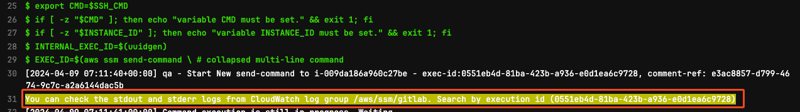

## CICD guides

[[Go to the parent README]](../README.md)

---
## Index
- [Related repositories](#related-repositories)
- [Directory Structure](#directory-structure)
- [Pipelines](#pipelines)
- [Runners and Kaniko (docker replacement)](#runners-and-kaniko--docker-replacement-)
    - [Runner selection](#runner-selection)
    - [Kaniko build](#kaniko-build)
- [FAQ](#faq)
    - [How to include(import) common jobs or templates into pipeline](#how-to-include-import--common-jobs-or-templates-into-pipeline)
    - [How to use common ssh/scp job](#how-to-use-common-sshscp-job)
    - [How to execute command as sudo with ssm send-commend](#how-to-execute-command-as-sudo-with-ssm-send-commend)
    - [How to debug ssm send-commend execution logs](#how-to-debug-ssm-send-commend-execution-logs)

---

## Related repositories

CICD common repositories:
- [GitLab-shared](https://sgts.gitlab-dedicated.com/wog/gvt/adex/adex/gitlab-shared)
    - CICD shared container images.

Frontend repositories:
- [Portal module](https://sgts.gitlab-dedicated.com/wog/gvt/adex/adex/sdx-portal): post login pages.
- [Auth module](https://sgts.gitlab-dedicated.com/wog/gvt/adex/adex/snps-auth): login & register pages.

Backend repositories:
- [Backend](https://sgts.gitlab-dedicated.com/wog/gvt/adex/adex/sense-backend)

---

## Directory Structure
``` bash
|----- This README.md
|----- .gitlab-ci.yml # main pipeline for multiple child pipelines
|----- gitlab-ci/  # contains child pipelines
    |----- App-EKS-chart-deploy.yml
    |----- App-EKS-chart-publish.yml
    |----- App-EKS-terraform.yml
    |----- Image-Builder.yml
    |----- Solace-EKS-terraform.yml
|----- scripts/ 
|----- templates/ 
```

---

## CICD guidelines

The repository follows recommendations for modularity and reusability,
allowing for multiple pipelines within a single repository.

SHIP-HATS Refs:
* [SHIP-HATS runners](https://docs.developer.tech.gov.sg/docs/ship-hats-docs/tools/gitlab/runners)
* [SHIP-HATS templates](https://sgts.gitlab-dedicated.com/wog/gvt/ship/ship-hats-templates/-/blob/main/README.md)

---

## Pipelines

The main `.gitlab-ci.yml` has multiple child pipelines.

### App-EKS-chart-deploy.yml

The child pipeline will deploy App EKS cluster-related charts into the APP cluster.
For instance, `cluster-common`, `ingress-controller` in [sense/base](../sense/base) folder.

Related details: [README.md](../sense/Readme.md)

### App-EKS-chart-publish.yml

The pipeline will create own managed charts and push those into [s3 bucket](https://s3.console.aws.amazon.com/s3/buckets/sdx-eks-artifacts?region=ap-southeast-1&tab=objects) 
so that the charts can be installed in ADEX's EKS environments.

Related details: [README.md](../sense/Readme.md)

### App-EKS-terraform.yml

The pipeline for provisioning `App EKS`. Currently, it is designed only for `dev`.

Related details: [README.md](../sense/Readme.md)

### Image-Builder.yml

The pipeline will bake `GCCS` based and [AWS official optimised](https://github.com/awslabs/amazon-eks-ami) AMI for node group instances.

#### How to select EKS control plane version

Before running the pipeline, provide the filter value to the variable `EKS_AMI_NAME` and `EKS_AMI_OWNER`
in the[ CICD variable settings](https://sgts.gitlab-dedicated.com/wog/gvt/adex/adex/sense-eks-deployment/-/settings/ci_cd).

#### How to select specific GCCS AMI by name and account ID

Before running the pipeline, provide the version value to the variable `EKS_AMI_CLUSTER_VERSION`
in the[ CICD variable settings](https://sgts.gitlab-dedicated.com/wog/gvt/adex/adex/sense-eks-deployment/-/settings/ci_cd).

#### Limitation

The pipeline design wraps the [Packer configuration](https://github.com/awslabs/amazon-eks-ami/blob/v20240209/eks-worker-al2.json#L120) 
from the official AWS EKS repository, which was initially developed for Amazon Linux 2.

The EOL of Amzn linux 2 is `2025-06-30`.

And now, the official repository supports Amzn linux 2023.
However, it has changed the folder structure and Packer configurations in recent releases.
Therefore, the pipeline uses the tag `v20240209` of the official repository.


### Solace-EKS-terraform.yml

The pipeline for provisioning `Solace EKS`.

Related folders: `modules`, `environments`

---

## Runners and Kaniko (docker replacement)

## Runner selection

SHIP-HATS GitLab's `shared-runners` are generally fast enough and scalable for multiple concurrent jobs.
However, the shared runners may be run as the root user but will not have enough privileges
to access the host. Therefore, `docker-in-docker` builds `WILL NOT` work as expected.
GitLab recommends using [kaniko](https://github.com/GoogleContainerTools/kaniko) for better security practices.

The `shared-runner` is suitable for most cases.


The exceptions by SHIP-HATS team guide are [here](https://docs.developer.tech.gov.sg/docs/ship-hats-docs/tools/gitlab/runners?id=recommended-approach).
For creating own runners, follow [this guide](https://docs.developer.tech.gov.sg/docs/ship-hats-docs/tools/gitlab/gitlab-runners)


## Kaniko build

The common job, [.docker-image-build-and-push](https://sgts.gitlab-dedicated.com/wog/gvt/adex/adex/sense-eks-deployment/-/blob/develop/cicd/templates/.container.yml?ref_type=heads#L161),
performs `kaniko` build following the command which is similar to `docker build ...`.

The simplest example:
`/kaniko/executor --dockerfile [Dockerfile location] --destination [ECR_registry/image_name:tag]`

The common job example:
```yaml
.docker-image-build-and-push:
  stage: build-push
  extends: .kaniko-builder
  script:
    - ( ... omitted ... )
    - >
      /kaniko/executor --context "$DOCKERFILE_CONTEXT" \
        --cache=true --cache-repo "$DOCKER_TARGET_REGISTRY/kaniko-caches" \
        --dockerfile "$DOCKERFILE_PATH/$DOCKERFILE_NAME" \
        --destination "$DOCKER_TARGET_REGISTRY/$DOCKER_IMAGE_NAME:$DOCKER_IMAGE_TAG" \
        --digest-file "$DIGESTFILE_NAME" $OPTS    
```

---

## FAQ

### How to include(import) common jobs or templates into pipeline

Use `include:` in your repo's gitlab yaml file,
```yaml
include:
  - project: "WOG/GVT/ADEX/ADEX/sense-eks-deployment"
    ref: "develop"
    file:
      - cicd/templates/.common.yml # aws, ssh, scp helpers
      - cicd/templates/.container.yml # kaniko, ecr helpers
      - cicd/templates/.helmfile.yml # helm, helmfile helpers
```

### How to use common ssh/scp job

1. Use `include:` in your repo's gitlab yaml file,
    ```yaml
    include:
      - project: "WOG/GVT/ADEX/ADEX/sense-eks-deployment"
        ref: "develop"
        file:
          - cicd/templates/.common.yml # aws, ssh, scp helpers
    ```

2. `extends` or `!reference` the common ssh, scp handler
- `SSH` example over AWS `SSM` send-command:
   ```yaml
   script:
     - export INSTANCE_ID=EC2-INSTANCE-ID
     - export SSH_CMD="echo 'hello-world'"
     - !reference [.ssm-ssh-sh, script]
   ```
- `SCP` example over AWS `SSM` start-session:
  ```yaml
  script:
    - ' ... scripts to zip file ... '
    - export INSTANCE_ID=EC2-INSTANCE-ID
    - export EC2-USER=ubuntu
    - export SOURCE=./my-file.zip
    - export DEST=/home/ubuntu/
    - !reference [.ssm-ssh-sh, script]
  ```

- Actual example:
  ```yaml
  sol-eks:copy-all:
    stage: copy
    extends: .helm-builder
    rules:
      - when: manual
    script:
      - |
        # Below export variables will be passed into the script of .ssm-clean-scp
        export INSTANCE_ID=$INSTANCE_ID
        export SCP_SOURCE_FOLDER=.
        export SOURCE=$SCP_SOURCE_FOLDER/repo.zip
        export EC2_USER=ubuntu
        export DEST=/home/$EC2_USER/tmp/tf-$CI_COMMIT_REF_SLUG
      - !reference [.ssm-clean-scp, script]
  ```

More detail on [!reference](https://docs.gitlab.com/ee/ci/yaml/yaml_optimization.html#reference-tags) tag.

### How to execute command as sudo with ssm send-commend

```yaml
    - export SSH_CMD="sudo bash -c 'helm ... '"
    - !reference [.ssm-ssh-sh, script]
```


### How to debug ssm send-commend execution logs

The `ssm send-command` execution results will be stored into CloudWatch log group `/aws/ssm/gitlab`.



Search by the execution ID can be collected from Job result.

- DEV/QA: [/aws/ssm/gitlab](https://ap-southeast-1.console.aws.amazon.com/cloudwatch/home?region=ap-southeast-1#logsV2:log-groups/log-group/$252Faws$252Fssm$252Fgitlab)
- PROD/INTRA: [/aws/ssm/gitlab](https://ap-southeast-1.console.aws.amazon.com/cloudwatch/home?region=ap-southeast-1#logsV2:log-groups/log-group/$252Faws$252Fssm$252Fgitlab)

